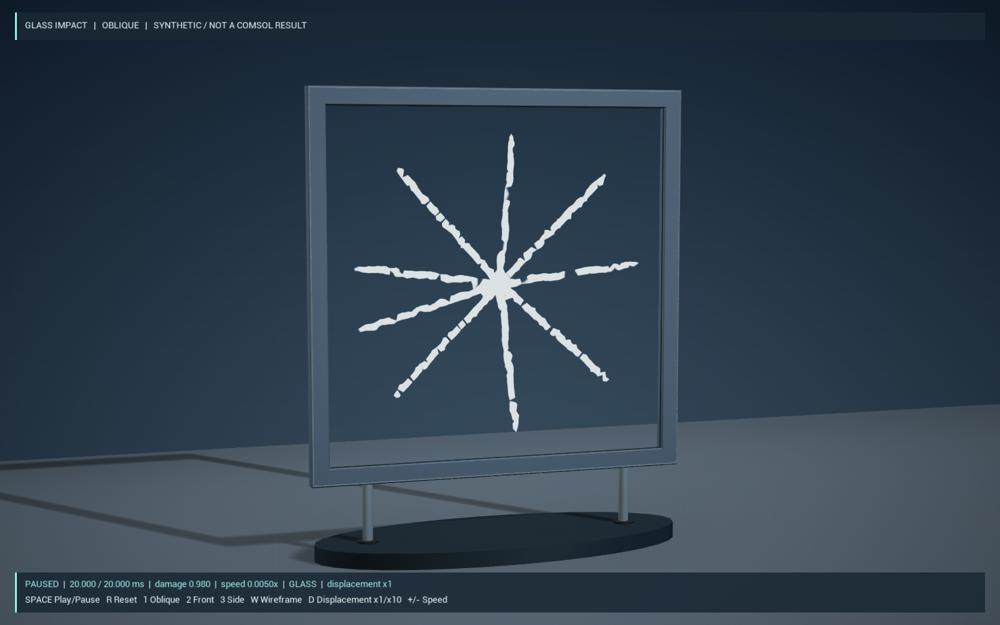
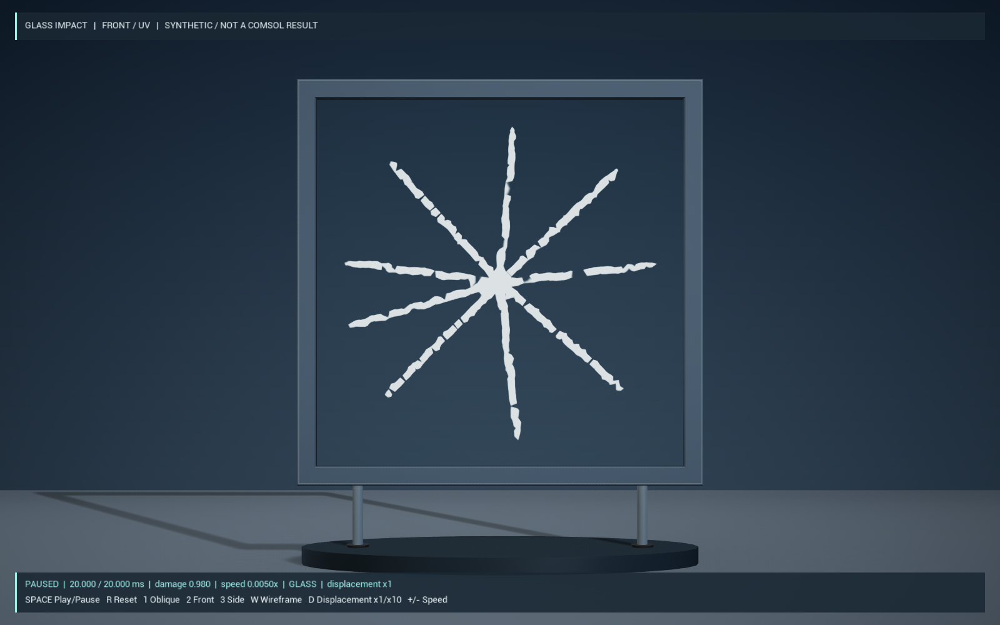
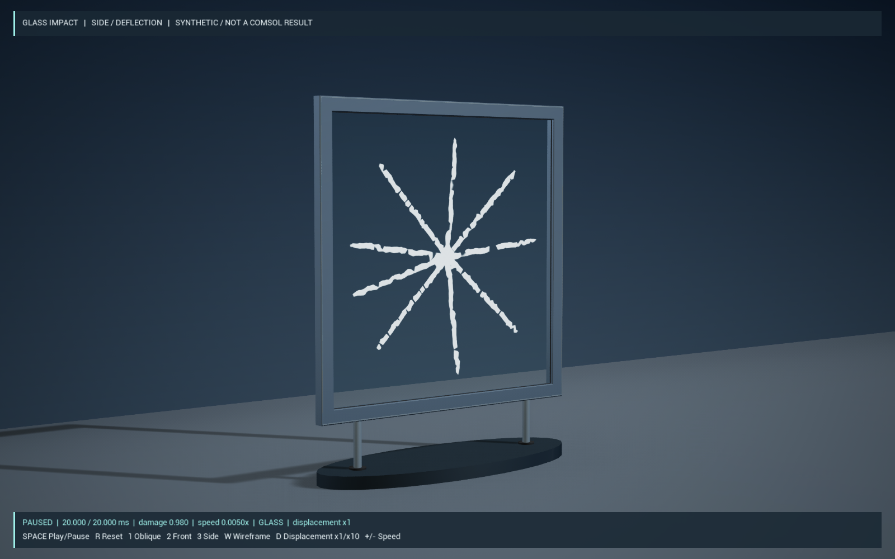
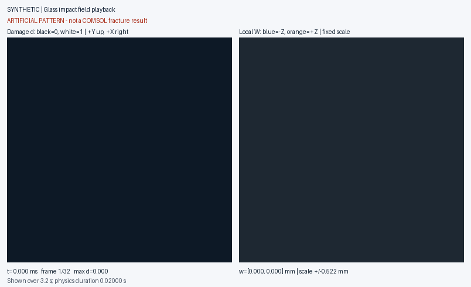
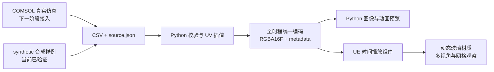

# GlassImpact · 玻璃冲击动态裂纹

**COMSOL 6.3 建模路线 · Python 3.9+ 数据工具 · Unreal Engine 5.6 · 固定工况方案 A**

将离线计算的玻璃损伤、应力和位移场转换为游戏可播放的数据，在 UE 中展示逐步扩展的裂纹、局部发白、粗糙度变化和小幅变形。项目包含数据转换器、自动化测试、COMSOL 建模指南及独立 UE 实验工程。

> **当前进度：合成数据 → Python 转换 → UE 显示已验证。真实 COMSOL 玻璃断裂求解尚未完成。**
> 仓库中的演示图片和样例均标记为 **SYNTHETIC**。裂纹形状由程序生成，用于验证数据处理和显示；不能作为玻璃材料或断裂模型正确性的证据。



*当前装配与构图版本的 UE 实际截图，显示物理时间 20 ms。玻璃、倒角框和密封条共享装配坐标，玻璃每边嵌入主框 1 cm。*

## 项目要解决什么

预计算效果可以保留物理场的空间分布和时间顺序，同时让游戏只承担数据播放与材质渲染。GlassImpact 第一阶段固定几何、冲击位置、方向和强度，为一套玻璃受击效果建立可替换数据的流程。

规划中的物理对象是 **1.0 m × 1.0 m、厚 8 mm 的普通钠钙玻璃板**，四边约束，球形刚体从中心垂直撞击。优先研究三维相场断裂；模块依赖、参数假设和替代方案见 [COMSOL 建模指南](docs/comsol_model_guide.md)。这些是待建立和验证的真实模型条件，不是当前合成数据的求解来源。

本阶段保持 UE 渲染网格拓扑不变，重点表现裂纹增长与小位移。完整碎片分离、多工况插值、机器学习代理模型和游戏运行时调用 COMSOL 均不在当前范围。

## 实际效果

下图均为当前场景的 UE 实际渲染，使用相同的合成物理场。

| 正面：检查四边接缝与裂纹 | 侧视：观察框深度与装配关系 |
|---|---|
|  |  |



*这是 **Python 场数据预览 GIF，不是 UE 录屏**。0–20 ms 的合成过程慢放为 3.2 秒，画面保留真实时间标签。UE 同样按物理时间插值相邻帧，演示默认慢放到约 4 秒。*

UE 支持玻璃材质与三角网格切换，便于检查形变。可查看 [高分辨率网格验证原图](docs/ue-captures/wire_oblique.png)：该图来自**装配修订前的场景**，显示 1.935 ms、位移放大 ×10，仅保留为网格验证记录。线框是 UE 渲染网格，不是 COMSOL 有限元网格；密集线条需按原始尺寸查看。当前装配修订说明见 [构图记录](docs/composition_refinement.md)。

## 技术流程与特点



- **来源可追溯**：`source.json` 与 `metadata.json` 记录数据来源、单位、坐标映射、时间和数值范围。
- **固定 UV 映射**：将不规则参考表面数据插值到规则纹理，UE 网格通过 UV0 读取，不要求节点一一对应。
- **避免逐帧闪烁**：损伤始终使用绝对 0–1 值；应力、能量和位移按全时程统一范围编码，不逐帧拉伸对比度。
- **保留小位移**：使用半精度浮点场数据和显式尺度解码，米转换为 UE 厘米；观察倍率不会改写物理数据。
- **统一播放时间**：损伤、位移、应力共用时间轴；组件提供播放、暂停、复位、Seek 和效果事件接口。
- **可直接观察实验体**：相机对准玻璃，提供斜视、正视、侧视和网格显示，HUD 标明来源、物理时间与位移倍率。

当前样例为 **32 帧 × 512×512、时长 0.02 s**。两份 RGBA16F 二进制共 **128 MiB**；UE 只保留两相邻时刻的两类纹理，纹理数据约 **8 MiB**，另有上传与渲染资源开销。同步读取仍需性能优化，60 FPS 是目标，尚未完成性能基准。

## 当前进度

| 工作项 | 状态与已验证范围 |
|---|---|
| 项目架构与数据协议 | 已建立；明确 SI/厘米、UV 方向、时间、精度及数据来源 |
| Python CSV 转换 | 已运行；输入检查、固定网格插值、统一编码、PNG16、元数据和预览 |
| 自动化测试 | 转换器 **23 项**、COMSOL 文本导出适配器 **4 项**通过 |
| 数据一致性 | 核查长度与哈希、覆盖范围及节点/纹理/half 编码后的损伤不可逆 |
| UE 5.6 C++ 与场景 | 本机编译、材质/关卡生成、时间定位截图及当前三视角验证通过 |
| 场景装配 | 已修正玻璃与框间隙，采用连续倒角框、贴合密封条及统一构图 |
| COMSOL 真实物理 | 已写可复现指南；**模块签出、官方基准、真实接触与断裂求解未验证** |
| VTK 输入 | 可选读取分支已提供，当前未执行；CSV 是已验证路径 |
| 粉尘与声音 | 有阈值事件和资源槽；尚未提供并验证完整特效、音效资产 |
| 持续交互与性能 | 键盘与事件接口已实现；全部交互回调、稳定 60 FPS 和游戏打包仍待专项验收 |

详细证据与限制见 [验收记录](docs/validation.md)。当前 UE 玻璃为双面显示的细分表面，不是具有真实厚度和内部裂面的三维破碎体。

## 从源码复现

### 1. 转换样例并运行测试

需要 Python 3.9+。在仓库根目录运行：

```powershell
git clone https://github.com/TDBBDT/comsol-ue-glassimpact.git
cd comsol-ue-glassimpact
python -m venv .venv
.venv/Scripts/Activate.ps1
python -m pip install -e .

python -m converter --input data/samples/synthetic --output data/processed/synthetic_demo --config config/glass_impact.yaml
python -m validator --processed data/processed/synthetic_demo
python -m unittest discover -s tests -v
python -m unittest discover -s comsol/export_templates -p "test_*.py" -v
```

转换器要求输出为**新目录**。重复运行时改用其他目录名，保留已有结果。生成内容包括 `state.rgba16f`、`displacement.rgba16f`、`metadata.json`、损伤 PNG16 和预览。

仓库包含明确标记的合成 CSV 样例。也可以使用 `python tools/generate_synthetic.py --output data/samples/my_synthetic` 生成另一份样例，输出目录同样应为空。默认配置使用 JSON 语法的有效 YAML；完整 YAML 支持安装 `".[yaml]"`，可选 VTK 支持安装 `".[vtk]"`。

### 2. 构建并运行 UE 演示

需要 **Windows、UE 5.6、Visual Studio C++ 工具链及 Windows SDK**。仓库提供源码、当前材质/关卡资产和场景生成脚本；不包含 UE 编译产物或转换后的 128 MiB 场数据。首次克隆需完成：

1. 运行上面的 Python 转换，生成 `data/processed/synthetic_demo`。
2. 按 [UE 搭建说明](docs/ue_setup_guide.md)编译 `GlassImpactEditor`。
3. 将 `metadata.json`、`state.rgba16f` 和 `displacement.rgba16f` 三份主数据复制到 `unreal/Content/GlassImpactData`；若要从源码重新生成材质和实验关卡，按指南运行 `setup_demo.py`。
4. 打开 `unreal/GlassImpact.uproject`，进入默认实验关卡并点击 Play。

完成首次构建与资产生成后，也可用启动脚本，按本机位置修改 UE 路径：

```powershell
powershell -ExecutionPolicy Bypass -File ./Open-GlassImpact.ps1 -EngineRoot 'D:/Path/To/UE_5.6'
```

| 操作 | 按键 |
|---|---|
| 播放 / 暂停 | 空格 |
| 复位 | R |
| 斜视 / 正面 / 侧视 | 1 / 2 / 3 |
| 玻璃 / 三角网格 | W |
| 位移显示 ×1 / ×10 | D |
| 调整播放速度 | + / − |

### 3. 替换为真实 COMSOL 数据

先按 [建模指南](docs/comsol_model_guide.md)确认模块并建立弹性接触基线；经过断裂模型验证后，导出同一固定参考表面的时间序列，填写 `source.json`。随后按 [真实数据替换步骤](docs/real_data_replacement.md)重新转换、验证和接入 UE。不能仅将合成数据的 `source_kind` 改名为 `comsol`。

## 下一步

1. **P0 · 建立可信的物理基线**：确认 COMSOL 6.3 模块可用性，复现官方相场示例；完成刚球与玻璃板的瞬态弹性接触，检查方向、单位、支撑和接触力。
2. **P1 · 接入真实断裂数据**：选择并标定断裂模型，检查损伤不可逆、能量平衡和网格/时间步收敛；导出真实 CSV，通过同一数据管线在 UE 对照物理时间展示。
3. **P2 · 完善游戏播放质量**：继续调整玻璃材质、厚度表现和多视角，补齐粉尘/声音资源与交互测试；加入异步预取并测量帧时间、内存和打包结果。

只有固定工况 A 的真实数据和播放质量通过验收后，才评估多工况 B。代理模型 C 当前不开发。各步骤的交付物与通过条件见 [项目路线图](docs/roadmap.md)。

## 目录与文档

```text
comsol/                    参数、COMSOL 导出模板和文本适配器
config/                    纹理分辨率、参考板坐标与转换配置
data/samples/synthetic/    合成 CSV 与来源清单
data/raw/                  真实 COMSOL 导出入口，当前无真实结果
data/processed/            本机生成数据，不提交 Git
tools/                     转换、校验、样例与预览工具
tests/                     Python 自动化测试
unreal/                    独立 UE 工程、C++、Shader 与资产生成脚本
docs/                      建模、架构、验证及仓库内演示图片
```

| 文档 | 内容 |
|---|---|
| [技术架构](docs/architecture.md) | 系统边界、技术选择和风险 |
| [COMSOL 建模](docs/comsol_model_guide.md) | 模块依赖、相场与替代路线、GUI 建模步骤 |
| [数据映射](docs/data_mapping.md) | 原始表、元数据、UV、插值与单位 |
| [格式与渲染选择](docs/formats_and_rendering.md) | PNG/EXR/浮点数组与 UE 播放方案 |
| [UE 搭建](docs/ue_setup_guide.md) | 构建、材质、组件、Blueprint 接线和截图 |
| [真实数据替换](docs/real_data_replacement.md) | 从真实求解输出到 UE 的检查步骤 |
| [验收记录](docs/validation.md) / [路线图](docs/roadmap.md) | 已完成证据、未验证事项与下一步 |

GlassImpact 是独立项目，不依赖此前的土体实验工程。所有演示图片均存放在仓库内，使用相对路径引用。
