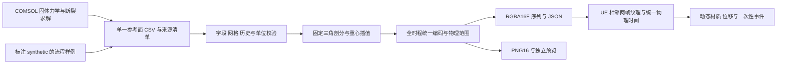

# 固定玻璃冲击：方案 A 架构

这是独立于 SoilBridge 的项目。第一版将一个固定玻璃板、中心位置、法向方向、指定质量与速度的事件离线求解，再通过 UV 场驱动 UE 固定拓扑网格与材质。当前软件演示从明确标注的合成数据开始；真实断裂计算和材料标定是单独的验收项。

## 技术选择

| 环节 | 本版选择 | 原因与限制 |
|---|---|---|
| 真实物理路线 | 3D Solid Mechanics + Phase Field in Solids 耦合 | 法向撞击包含弯曲和厚度方向应力，二维平面应力不能直接替代；计算成本高 |
| 原始交换 | 统一表头 CSV + source.json | 易审计。不能把体积节点不加区分投影成一张表面纹理 |
| 空间插值 | 固定参考 XY 三角剖分，固定重心权重 | 时间序列使用同一权重；保留不可逆损伤的单调性。无覆盖区域显式屏蔽 |
| 时间 | metadata 时间戳 + 线性帧间插值 | 60 FPS 游戏时间与离线采样分开；不以游戏帧号索引物理帧 |
| 编码 | 两个 little-endian RGBA16F 二进制序列 | 损伤保留 0..1，应力/位移用全时程范围；避免 PNG8 丢失小位移 |
| UE 渲染 | 两对瞬态 Texture2D + 动态材质 | 常量数量的 GPU 纹理，省去大量纹理资产导入；按帧对读取数据 |
| 网格 | 规则细分平面，拓扑固定 | 四顶点平面无法通过 WPO 表达局部弯曲；线框显示真实渲染网格形状 |
| 事件 | 时间零点、损伤阈值越过、结束 | 阈值事件每次重放最多一次；音效/Niagara 使用用户指定资源 |

512×512 纹理、32 帧、每像素两个 RGBA16F 场约占 **128 MiB** 磁盘空间。两帧×两个场的有效纹理像素约 **8 MiB**，不计上传缓存、引擎开销与网格。60 FPS 是目标，不是本阶段已证明的性能；同步磁盘读帧可能产生卡顿，需在目标平台测量，后续再做异步预读。

## 参数与物理风险

1 m×1 m×8 mm 玻璃几何可用，但应明确“全固支”是理想化边界，不等于实际窗框。缺少球体质量、半径、速度、玻璃断裂韧度、表面缺陷和材料标定；建模指南给出假设起点，不能据此保证真实玻璃一定开裂。

中心完全对称的几何和材料不自动保证离散放射状裂纹。路径受缺陷、损伤正则化、网格及接触影响；若必须指定美术裂纹，必须单独标注为程序化/预定义路径。相场带宽是正则化长度，不是肉眼看到的真实裂缝开口宽度。

20 ms 内的真实过程在 60 FPS 下只有约 1.2 个游戏帧，无法直观看清传播。演示应默认慢放并显示时间/倍率，正常速度仍应按真实时间结束。输出 32～64 帧不代表内部求解时间步已经足够小。

## 分阶段验收

1. 数据层：合成来源、坐标/时间、插值、全局编码、不可逆检查、预览和自动化测试。
2. UE 层：纹理读取与解码、局部位移到世界坐标、材质参数、重放事件和对准玻璃的多视角/线框观察。
3. 真实求解层：许可证确认、无损弹性接触基线、断裂模型、接触/时间步/网格/能量检查，再替换数据。
4. 表现层：真实数据的视觉阈值选择、声音/颗粒资产指定、打包与 60 FPS 测量。

本轮不训练代理模型，不在游戏中运行 COMSOL，不自动更新 SoilBridge 或其 GitHub 仓库。
